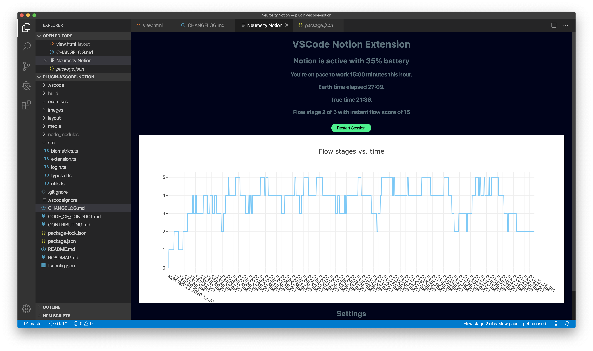

# Notion VSCode by Neurosity

Finally, an inside look into your mind while programming.

This document (the README file) is a hub to give you some information about the project. Jump straight to one of the sections below, or just scroll down to find out more.

- [Using the Extension](#using-the-extension)
- [What are we doing? (And why?)](#what-are-we-doing)
- [Who are we?](#who-are-we)
- [What do we need?](#what-do-we-need)
- [How can you get involved?](#get-involved)
- [Get in touch](#contact-us)
- [Find out more](#find-out-more)

## Using the Extension

### Authenticating

Once the extension is installed, you may click on the `Notion login` button that is now on your status bar. You will be prompted to sign in with your email, press that. Then enter the email you use for the [Developer Console](console.neurosity.co). After entering your email, you will need to enter your device id. Find your ID on [console.neurosity.co/settings](console.neurosity.co/settings), for more help, [learn how to get Notion Device ID](https://support.neurosity.co/hc/en-us/articles/360037198152-Get-Notion-Device-ID). An email code will then be sent to your email. Select the option to `Sign in to Neurosity` which will bring you back to the Developer Console but prompt you with a code to copy. Copy that code and paste that into the prompt on the developer extension. Now you are authenticated and can see your real time flow score when wearing the Notion headset. To see more stats click the `Flow stage...` button on the status bar.

## What are we doing?

### The problem

- People lose focus while programming
- People don't know what influences their productivity
- People associate time spent coding and number of lines written as the only metrics for productivity
- People want to build on top of Notion and need a seed/starting point
- Notion needs a way to convey your current brain state

So, there are a lot of needs to align notion with developers and even if someone gets a notion, wears it and is near wifi, they still can't get a daily utility out of Notion.

### The solution

The VSCode extension will:

- Provide a real time flow stage indicator
- Show historic data for your current programming session
- Provide an example application for developers to run with

Using VSCode Notion Plugin allows you, the user, to quickly integrate Notion so you can begin investing in yourself by hacking your life.

## Who are we?

Mainly, we are Neurosity. [AJ Keller](https://twitter.com/andrewjaykeller) started this project to boost his productivity. We seek to open source this application as a _seed_ that blossoms into dozens of applications. If we can write applications better and faster, then the lives of programmers will improve.

## What do we need?

**You**! In whatever way you can help.

We need expertise in programming, user experience, software sustainability, documentation, technical writing, and project management.

We'd love your feedback along the way.

Our primary goal is to provide a way to get objective insights into the mind; we're excited to support the professional development of any of our contributors. If you're looking to learn to code, try out working collaboratively, or translate you skills to the digital domain, we're here to help.

## Get involved

If you think you can help in any of the areas listed above (and we bet you can) or in any of the many areas that we haven't yet thought of (and here we're _sure_ you can) then please check out our [contributors' guidelines](CONTRIBUTING.md) and our [roadmap](ROADMAP.md).

Please note that it's very important to us that we maintain a positive and supportive environment for everyone who wants to participate. When you join us we ask that you follow our [code of conduct](CODE_OF_CONDUCT.md) in all interactions both on and offline.

## Contact us

If you want to report a problem or suggest an enhancement, we'd love for you to [open an issue](../../issues) at this Github repository so we can get right on it!

## Find out more

You might be interested in:

- Buy a [Notion](https://neurosity.co).

And of course, you'll want to know our:

- [Contributors' guidelines](CONTRIBUTING.md)
- [Roadmap](ROADMAP.md)

## Thank you

Thank you so much (Danke schön! Merci beaucoup!) for visiting the project and we do hope that you'll join us on this amazing journey to provide a stable and powerful interface for Notion.
